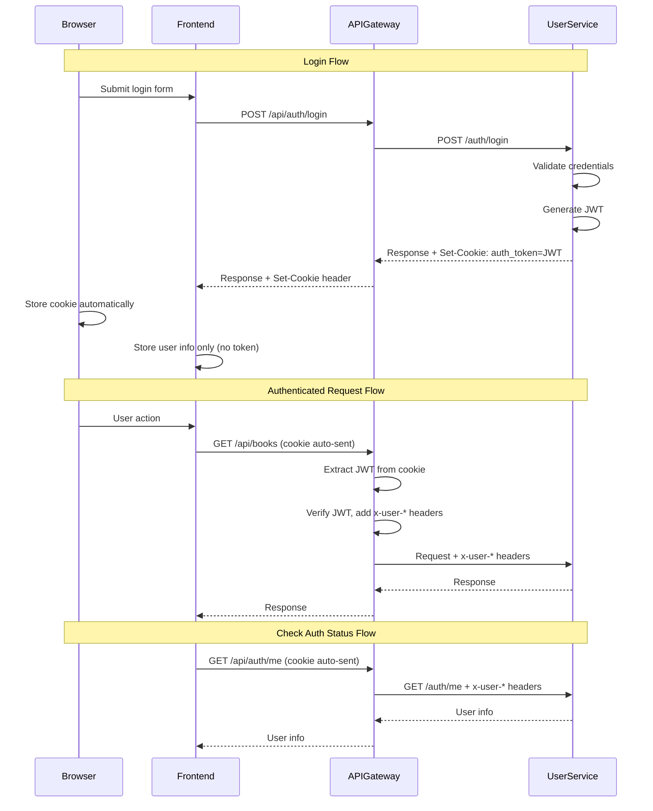

# Design Document: HttpOnly Cookie Authentication

## Overview

Thiết kế chuyển đổi cơ chế authentication từ localStorage-based JWT sang HttpOnly Cookie-based JWT cho hệ thống bookstore-microservices. Thay đổi này tăng cường bảo mật bằng cách ngăn JavaScript truy cập token, giảm thiểu rủi ro XSS attacks.

## Architecture



## Components and Interfaces

### 1. User Service - Cookie Helper Module

**File:** `user-service/src/utils/cookieHelper.ts`

```typescript
interface CookieOptions {
  httpOnly: boolean;
  secure: boolean;
  sameSite: 'strict' | 'lax' | 'none';
  maxAge: number;
  path: string;
}

// Set auth cookie with JWT token
function setAuthCookie(res: Response, token: string): void;

// Clear auth cookie
function clearAuthCookie(res: Response): void;

// Get cookie options based on environment
function getCookieOptions(): CookieOptions;
```

### 2. User Service - Auth Controller Updates

**File:** `user-service/src/controllers/authController.ts`

Changes:
- `login()`: Set HttpOnly cookie instead of returning token in body
- `verifyEmail()`: Set HttpOnly cookie after OTP verification
- `logout()`: Clear the auth cookie
- New `getMe()`: Return current user info from JWT

### 3. User Service - New /auth/me Endpoint

**File:** `user-service/src/routes/auth.ts`

```typescript
// GET /auth/me - Get current authenticated user
router.get('/me', authMiddleware, AuthController.getMe);
```

### 4. API Gateway - Cookie Extraction Middleware

**File:** `api-gateway/src/middleware/cookieAuth.ts`

```typescript
// Extract JWT from cookie and add to request
function cookieAuthMiddleware(req: Request, res: Response, next: NextFunction): void;
```

### 5. API Gateway - CORS Updates

**File:** `api-gateway/src/middleware/cors.ts`

Changes:
- Set `credentials: true`
- Use specific origin instead of wildcard

### 6. Frontend - API Client Updates

**File:** `frontend_service/src/api/client.ts`

Changes:
- Add `withCredentials: true` to axios config
- Remove token from localStorage operations

### 7. Frontend - Auth Store Updates

**File:** `frontend_service/src/store/authStore.ts`

Changes:
- Remove token from state
- Remove localStorage token operations
- Add `checkAuth()` method to call /api/auth/me

## Data Models

### Cookie Structure

```
Cookie Name: auth_token
Value: <JWT_TOKEN>
Attributes:
  - HttpOnly: true
  - Secure: true (production) / false (development)
  - SameSite: Lax
  - Path: /
  - Max-Age: 86400 (24 hours, matching JWT expiration)
```

### Auth Response (Updated)

```typescript
// Before (token in body)
interface AuthResponse {
  token: string;
  user: UserInfo;
  expires_in: string;
}

// After (no token in body)
interface AuthResponse {
  user: UserInfo;
  expires_in: string;
  // token is set via Set-Cookie header
}
```

### /auth/me Response

```typescript
interface MeResponse {
  user: {
    id: number;
    email: string;
    username: string;
    full_name: string;
  };
}
```


## Correctness Properties

*A property is a characteristic or behavior that should hold true across all valid executions of a system-essentially, a formal statement about what the system should do. Properties serve as the bridge between human-readable specifications and machine-verifiable correctness guarantees.*

### Property 1: Auth cookie has correct security attributes
*For any* successful authentication operation (login, OTP verification, OAuth), the Set-Cookie header SHALL contain a cookie named `auth_token` with HttpOnly=true, SameSite=Lax, and Secure matching the environment (true in production, false in development).
**Validates: Requirements 1.1, 1.2, 1.4, 1.5**

### Property 2: Logout clears auth cookie correctly
*For any* logout request, the response SHALL contain a Set-Cookie header that clears the `auth_token` cookie by setting Max-Age=0 or an expired date, with the same path as the original cookie.
**Validates: Requirements 2.1, 2.2**

### Property 3: Cookie JWT extraction produces correct user headers
*For any* request with a valid `auth_token` cookie containing a JWT, the api-gateway SHALL extract the JWT and add headers x-user-id, x-user-email, and x-user-role to proxied requests with values matching the JWT payload.
**Validates: Requirements 3.1, 3.2**

### Property 4: Invalid cookie returns 401
*For any* request with an invalid, expired, or missing `auth_token` cookie to a protected endpoint, the api-gateway SHALL return HTTP 401 Unauthorized.
**Validates: Requirements 3.4**

### Property 5: Frontend does not store token in localStorage
*For any* successful authentication response, the frontend SHALL NOT store any value with key `auth_token` in localStorage, and the Zustand store SHALL NOT contain a `token` field.
**Validates: Requirements 4.2, 4.3**

### Property 6: /auth/me returns user info for valid cookie
*For any* request to /auth/me with a valid `auth_token` cookie, the endpoint SHALL return user information matching the JWT payload. For invalid/missing cookies, it SHALL return 401.
**Validates: Requirements 5.2, 5.3**

### Property 7: CORS configured for credentials
*For any* cross-origin request, the api-gateway SHALL respond with `Access-Control-Allow-Credentials: true` and `Access-Control-Allow-Origin` set to a specific origin (not wildcard `*`).
**Validates: Requirements 6.1, 6.2**

### Property 8: OAuth redirect does not expose token in URL
*For any* OAuth callback redirect, the redirect URL SHALL NOT contain the JWT token as a query parameter or hash fragment.
**Validates: Requirements 7.2**

## Error Handling

### Backend Error Scenarios

| Scenario | HTTP Status | Error Code | Message |
|----------|-------------|------------|---------|
| Missing auth cookie on protected route | 401 | NO_AUTH_COOKIE | Authentication required |
| Invalid JWT in cookie | 401 | INVALID_TOKEN | Invalid authentication token |
| Expired JWT in cookie | 401 | TOKEN_EXPIRED | Authentication token has expired |
| Cookie parsing error | 400 | COOKIE_PARSE_ERROR | Failed to parse authentication cookie |

### Frontend Error Handling

1. **401 from /api/auth/me**: Clear user state, redirect to login
2. **401 from any API call**: Show "Session expired" toast, redirect to login
3. **Network error**: Show retry option, don't clear auth state

## Testing Strategy

### Property-Based Testing Library
**Library:** fast-check (TypeScript)

### Unit Tests

1. **Cookie Helper Tests**
   - Test `setAuthCookie()` sets correct attributes
   - Test `clearAuthCookie()` clears cookie correctly
   - Test `getCookieOptions()` returns environment-appropriate options

2. **Auth Controller Tests**
   - Test login sets cookie in response
   - Test verifyEmail sets cookie in response
   - Test logout clears cookie
   - Test getMe returns user info

3. **Cookie Auth Middleware Tests**
   - Test JWT extraction from cookie
   - Test header injection to proxied requests
   - Test 401 for invalid cookies

### Property-Based Tests

Each property-based test MUST:
- Run minimum 100 iterations
- Be tagged with format: `**Feature: httponly-cookie-auth, Property {number}: {property_text}**`
- Reference the correctness property it implements

1. **Property 1 Test**: Generate random valid credentials, perform auth, verify cookie attributes
2. **Property 2 Test**: Generate random auth states, perform logout, verify cookie cleared
3. **Property 3 Test**: Generate random valid JWTs, send with cookie, verify headers added
4. **Property 4 Test**: Generate random invalid/expired JWTs, verify 401 response
5. **Property 5 Test**: Generate random auth responses, verify no localStorage token
6. **Property 6 Test**: Generate random valid/invalid cookies, verify /auth/me response
7. **Property 7 Test**: Generate random origins, verify CORS headers
8. **Property 8 Test**: Generate random OAuth callbacks, verify no token in redirect URL

### Integration Tests

1. Full login flow with cookie verification
2. Full logout flow with cookie clearing
3. Protected route access with valid/invalid cookies
4. OAuth flow with cookie setting
